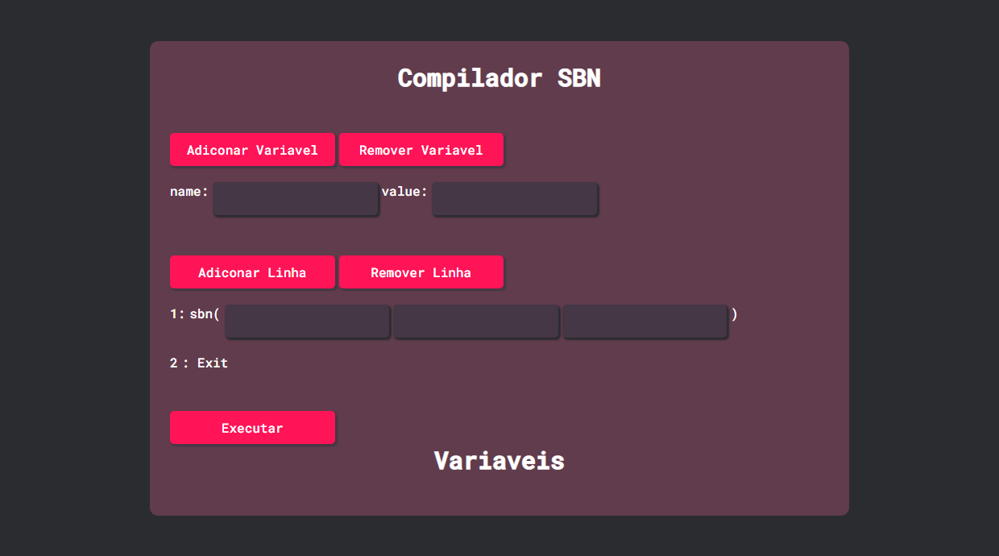

    

<h1 align="center">Compilador SBN</h1>

    <h3>
        <a href="https://vjrsz.github.io/CompiladorSBN-WEB/v1/index.html" target="_blank">Live</a>
    </h3>

<h2>Built With</h2>
<h3>Languages and Tools</h3>

 HTML5

 CSS3

JS

<h2 align="center">by Valter Junior</h2>

